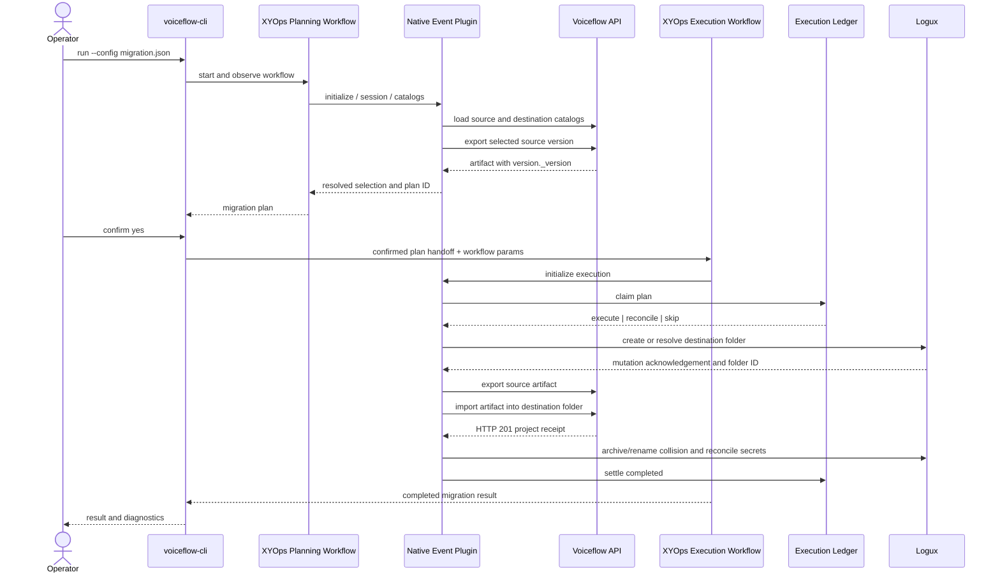
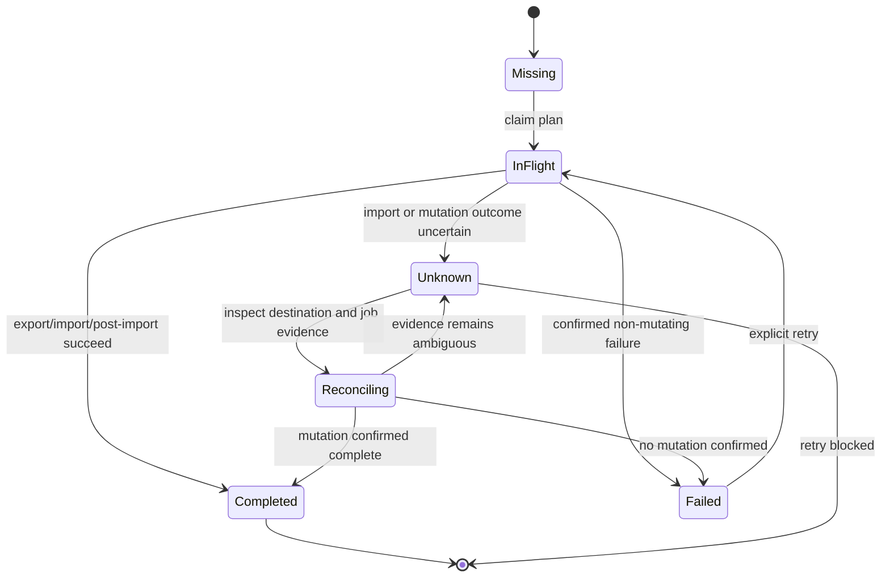

# Voiceflow migration workflow UML

Current runtime shape after the execution-ledger refactor. The CLI defaults to
`XYOPS_MIGRATION_MODE=workflow`; `events` remains a compatibility mode.

## End-to-end sequence

## Execution state model

## Main boundaries

```mermaid
flowchart LR
    Config[Migration config] --> CLI[CLI boundary]
    CLI --> Planning[Planning workflow]
    Planning --> Schema[Read source version._version]
    Schema --> PlanID[Canonical plan ID]
    PlanID --> Confirm[Explicit confirmation]
    Confirm --> Execution[Execution workflow]
    Execution --> Ledger[Execution ledger]
    Execution --> Folder[Logux folder lifecycle]
    Execution --> Export[Voiceflow export]
    Export --> Import[Voiceflow import]
    Import --> Receipt[Validated project receipt]
    Receipt --> Post[Archive/rename/secrets]
    Post --> Ledger
    Ledger --> Result[Safe terminal result]
```

